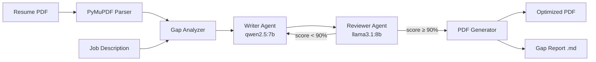

# 🎯 Resume-JD Gap Analyzer & Optimizer

AI-powered tool that analyzes a resume against a Job Description, identifies alignment gaps, and iteratively optimizes resume content using a multi-agent LLM pipeline — all locally, with layout preservation.

## Architecture

```
Resume PDF → Parse → Gap Analysis → Writer↔Reviewer Loop → Optimized PDF + Report
```



## Tech Stack

| Layer | Tool |
|-------|------|
| LLM Runtime | Ollama (local) |
| Writer Model | `qwen2.5:7b` |
| Reviewer Model | `llama3.1:8b` |
| Orchestration | LangChain + LangGraph |
| Schema Validation | Pydantic |
| PDF Parsing & Editing | PyMuPDF (overlay technique) |
| Observability | LangSmith (optional) |
| Interface | Jupyter Notebook |

## Project Structure

```
ResumeMaker/
├── config.yaml                 # LLM, agent, PDF settings + system prompts
├── requirements.txt            # Dependencies
├── resume_optimizer.ipynb      # Sole interface (7 cells)
├── pipeline.py                 # LangGraph state machine (6 nodes)
├── models/schemas.py           # Pydantic models (ParsedResume, GapAnalysis, etc.)
├── agents/
│   ├── writer.py               # Writer agent — proposes content edits
│   └── reviewer.py             # Reviewer agent — validates & scores
├── utils/
│   ├── pdf_reader.py           # PDF text + position extraction
│   ├── llm.py                  # Dual-model ChatOllama wrapper
│   └── pdf_writer.py           # Layout-preserving PDF overlay editor
└── output/                     # Generated files
    ├── optimized_resume.pdf
    └── gap_report.md
```

## Quick Start

### Prerequisites

- **Python 3.9+**
- **Ollama** running locally with models pulled:
  ```bash
  ollama serve
  ollama pull qwen2.5:7b
  ollama pull llama3.1:8b
  ```

### Install

```bash
cd ResumeMaker
pip install -r requirements.txt
```

### Run

```bash
jupyter notebook resume_optimizer.ipynb
```

1. **Cell 1** — Loads config & sets up tracing
2. **Cell 2** — Parses your resume PDF, displays sections
3. **Cell 3** — Paste your target Job Description
4. **Cell 4** — Runs the optimization pipeline (Writer↔Reviewer loop)
5. **Cell 5** — Displays gap analysis report
6. **Cell 6** — Shows iteration score progression
7. **Cell 7** — Lists output files

### CLI (alternative)

```bash
python pipeline.py /path/to/resume.pdf --jd "Job description text here"
```

## Configuration

Edit `config.yaml` to customize:

- **Models**: swap `writer_model` / `reviewer_model`
- **Agent settings**: `max_iterations`, `approval_threshold` (0-100)
- **System prompts**: fine-tune Writer/Reviewer behavior
- **LangSmith**: set `enabled: true` + your `api_key` for tracing

## Outputs

| File | Description |
|------|-------------|
| `output/optimized_resume.pdf` | Layout-preserved resume with optimized content |
| `output/gap_report.md` | Full gap analysis: scores, missing skills, changes |

## System Rules

1. ❌ Never invents experience or credentials
2. 📐 Never alters formatting / layout / fonts
3. ✅ Only applies Reviewer-approved edits
4. 📋 All LLM outputs are Pydantic-validated
5. 🔁 Loop terminates deterministically (score ≥ 90% or max iterations)

## Benchmarks

| Metric | Value |
|--------|-------|
| Initial → Final Score | 80% → 95% |
| Iterations to approval | 1 |
| Pipeline runtime | ~108s |
| PDF output size | ~140 KB |

---

Built with ❤️ using LangChain, LangGraph, Ollama, and PyMuPDF.
